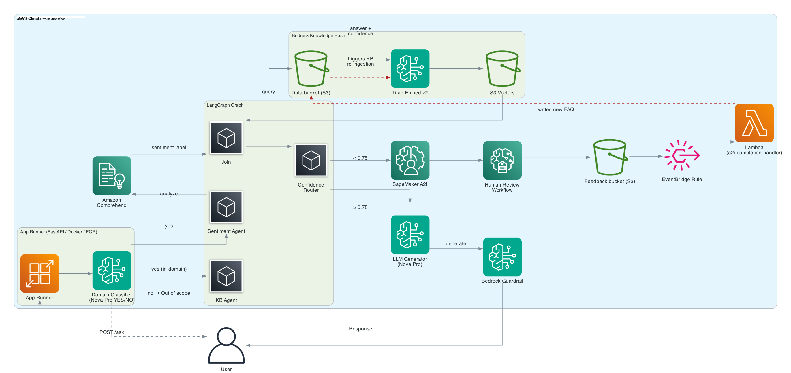

# Multi-Agent Customer Support - AWS Cloud Integration (LangGraph)

🟢 Interactive Architecture Walkthrough: [Live Demo](https://mortab1000.github.io/Multi-Agent-Customer-Support---LangGraph-on-AWS/) - Click to see the step-by-step data flow.

> **Disclaimer & Context:** This repository was developed following a hands-on LangGraph & AWS workshop. While the core agentic logic (LangGraph states and nodes) served as the foundation, **my primary focus and contribution was implementing the cloud architecture**. This includes integrating the multi-agent system with AWS services (App Runner, EventBridge, Lambda, SageMaker A2I), setting up the automated CI/CD deployment scripts, and managing the serverless infrastructure.

A production-ready multi-agent pipeline that answers customer support questions using LangGraph, Amazon Bedrock, Amazon Comprehend, and SageMaker A2I.

Built as a hands-on workshop lab demonstrating real-world multi-agent architecture on AWS.



## Architecture & Integration Flow

```text
POST /ask → Domain Classifier (api.py) → LangGraph Graph
                                              ├── KB Agent (Bedrock Knowledge Base)
                                              ├── Sentiment Agent (Amazon Comprehend)
                                              └── Join → Confidence Router
                                                              ├── ≥ 0.75 → LLM Generator (Nova Pro + Guardrail v4)
                                                              └── < 0.75  → Human Escalation (SageMaker A2I)
```

### Key Cloud & Infrastructure Integrations:

- **Serverless Deployment:** The LangGraph API is containerized using Docker and deployed securely on AWS App Runner.
- **Human-in-the-Loop (HITL):** Integrated SageMaker A2I to catch low-confidence LLM outputs and route them to human reviewers.
- **Automated Feedback Loop:** Configured an event-driven architecture using EventBridge and Lambda (`a2i_completion_handler.py`). When a human answers an escalated ticket, the system automatically writes it back to S3 and triggers a Bedrock Knowledge Base sync to improve future answers.
- **LLM is skipped entirely** when the KB has no relevant answer (prevents hallucination)
- **Infrastructure as Code (IaC)**: Utilized CloudFormation templates for provisioning S3 buckets, IAM roles, ECR, and Lambda.

## Project Structure

<details>
<summary><b>📂 Click to view the full directory tree</b></summary>

```text
├── app/
│   ├── api.py                    # FastAPI wrapper + domain classifier
│   └── main.py                   # LangGraph graph architecture
├── data/
│   └── faqs/                     # Source files for Bedrock Knowledge Base
├── infra/
│   ├── cloudformation.yaml       # IaC for S3, IAM, ECR, EventBridge, Lambda
│   └── a2i_worker_template.xml   # SageMaker A2I reviewer UI template
├── lambda/
│   └── a2i_completion_handler.py # Feedback loop logic: A2I → S3 → KB sync
├── scripts/
│   ├── deploy.sh                 # Fully automated deployment script
│   └── destroy.sh                # Full cloud teardown script
├── Dockerfile                    # Container configuration (python:3.12-slim)
├── mcp_server.py                 # MCP Server: Bridge for Claude Desktop/Cursor tools  
└── requirements.txt
```
</details>

## Quick Start

### Prerequisites

- AWS account with permissions for Bedrock, S3, IAM, ECR, App Runner, Comprehend, SageMaker
- AWS CLI configured (`aws configure` or named profile)
- Docker (for App Runner deployment)
- Python 3.12+


### 1. Install dependencies

```bash
python3 -m venv .venv
source .venv/bin/activate
pip install -r requirements.txt
```

### 2. Deploy
The deployment process is automated via bash scripts that handle CloudFormation execution, Docker image building, ECR pushing, and App Runner deployment.

```bash
# Full automated deployment (CloudFormation → KB → Guardrail → Docker → ECR → App Runner)
bash scripts/deploy.sh
```

The script will print the live App Runner URL when complete.


### 3. Test the API

```bash
curl -s -X POST <YOUR_APP_RUNNER_URL>/ask \
  -H "Content-Type: application/json" \
  -d '{"question":"What is Leumi Trade?"}' | jq
```

### 4. Tear down infrastructure

```bash
bash scripts/destroy.sh
```

## AWS Resources Used

| Service | Purpose |
|---------|---------|
| Amazon Bedrock (Nova Pro) | LLM response generation |
| Amazon Bedrock Knowledge Bases | FAQ retrieval (Titan Embeddings + S3 Vectors) |
| Amazon Bedrock Guardrails | Content filtering + contextual grounding |
| Amazon Comprehend | Sentiment analysis |
| SageMaker A2I | Human escalation review |
| AWS App Runner | Serverless container hosting |
| Amazon ECR | Docker image registry |
| AWS Lambda + EventBridge | A2I feedback loop automation |
| Amazon S3 | FAQ data + feedback storage |

## MCP integration

The project now supports Model Context Protocol (MCP), allowing AI agents (like Claude or Cursor) to directly query the AWS Knowledge Base as a tool.